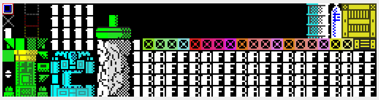

# PUSHK Archiver: representation-first compression filter `rdrop`


[](https://isocpp.org/)
[](https://cmake.org/)
[](https://opensource.org/licenses/MIT)


**Filter name** `pushk2pre3rdrop`  

**Author** V01G04A81 Viktor Glebov


---

## Usage

```bash
    pushk2pre3rdrop <cmd> <file_name_input> <file_name_rdroptbl> <file_name_output> <start_offset> <count> <block_size>
```

### Command Line Parameters

| Parameter            | Description |
|---------------------|-------------|
| `cmd`               | Operation mode: `s` — split, `m` — merge, `v` — version |
| `file_name_input`   | Path to input file |
| `file_name_rdroptbl`| Path to RDROP table file |
| `file_name_output`  | Path to output file |
| `start_offset`      | Start offset in bytes |
| `count`             | Number of blocks to process (maximum: 256) |
| `block_size`        | Size of each block in bytes |


### Example

example:

```
    pushk2pre3rdrop s example10b.bin example10bd.bin.rdrop.bin example10bd.bin 0 256 64
```

where :


| Parameter / Value                 | Description |
|----------------------------------|-------------|
| `s`                              | Split command |
| `example10b.bin`                 | Source file |
| `example10bd.bin.rdrop.bin`      | Output RDROP table file name |
| `example10bd.bin`                | Output transformed file name |
| `0`                              | Offset |
| `256`                            | Count |
| `64`                             | Block size |


---

## Tests

| Preview                                     | File            | Author     |
| ------------------------------------------- | --------------- | ---------- |
|    | `example7.bin`  | V01G04A81  |
|    | `example8.bin`  | V01G04A81  |
|    | `example9.bin`  | V01G04A81  |
|   | `example10.bin` | V01G04A81  |


- Original File (MD5)
- Split → RDrop + Transformed (MD5)

---

### Pipeline Results

| Input file        | Operation | Config / Mode        | Output file(s) |
|------------------|----------|----------------------|----------------|
| example7.bin     | [move]   | cl_filter_b.yaml     | example7b.bin |
| example7b.bin    | [rdrp]   | 64                   | example7bd.bin + example7b_rdrop.bin |
| example8.bin     | [rdrp]   | 2048                 | example8d.bin + example8_rdrop.bin |
| example8d.bin    | [move]   | cl_filter_b.yaml     | example8db.bin |
| example9.bin     | [move]   | cl_filter_b.yaml     | example9b.bin |
| example9b.bin    | [rdrp]   | 64                   | example9bd.bin + example9b_rdrop.bin |
| example10.bin    | [move]   | cl_filter_b.yaml     | example10b.bin |
| example10b.bin   | [rdrp]   | 64                   | example10bd.bin + example10b_rdrop.bin |

---

### Archiving Tools

|  Archiver  |  Version  |  Info  | * Parameters |
|--------|-----------|--------|--------|
|  zip  |  3.0  |  This is Zip 3.0<br>(July 5th 2008), by Info-ZIP.  | -9 |
|  rar  |  7.00  |  RAR 7.00<br>Copyright (c) 1993-2024 Alexander Roshal<br>26 Feb 2024  | -m5 |
|  lzma  |  5.4.5  |  xz (XZ Utils) 5.4.5  | -9 |
|  7z  |  23.01  |  7-Zip 23.01 (x64) :<br>Copyright (c) 1999-2023 Igor Pavlov :<br>2023-06-20  | -mx9 |
|  xz  |  5.4.5  |  xz (XZ Utils) 5.4.5  | -9 |
|  zstd  |  1.5.5  |  Zstandard CLI (64-bit)<br>v1.5.5, by Yann Collet  | --ultra -22 |
|  brotli  |  1.1.0  |  brotli 1.1.0  | -q 11 |
|  bzip2  |  1.0.8  |  bzip2, a block-sorting file compressor.<br>Version 1.0.8, 13-Jul-2019.  | -9 |
|  gzip  |  1.12  |  gzip 1.12  | -9 |
|  arj  |  3.10  |  ARJ32 v 3.10,<br>Copyright (c) 1998-2004, ARJ Software Russia.  | -jm

***Parameters: Max compression rate***

---

### Original files before conversions

| Source File Name | Size   | MD5    |
|------------------|--------|--------|
| example7b.bin | 16384 | 37fb285e628b0c085f5581bc3d340d24 |
| example8.bin | 16384 | dca17a92e634a3c93a458f37ea6629bb |
| example9b.bin | 16384 | a330ae5d3aa4ebedd31a93f2747c5b7a |
| example10b.bin | 16384 | a1143482d7b07abd139c14b593164601 |

### Compressed original files

| File Name  | bin    | zip |rar |lzma |7z |xz |zstd |brotli |bzip2 |gzip |arj |
|------------|--------|---|---|---|---|---|---|---|---|---|---|
| example7b.bin | 16384 | 2908 |2784 |1723 |1828 |1768 |2550 |2033 |3381 |2764 |2940 |
| example8.bin | 16384 | 2096 |1906 |1688 |1780 |1736 |1691 |1728 |1949 |1953 |2071 |
| example9b.bin | 16384 | 1584 |1384 |1229 |1347 |1276 |1252 |1210 |1673 |1441 |1553 |
| example10b.bin | 16384 | 1717 |1546 |1370 |1474 |1416 |1301 |1342 |1619 |1572 |1682 |

---

## RDrop Transformation !

| File Name  | Size   | MD5    |
|------------|--------|--------|
| example7bd.bin.rdrop.bin | 398 | e7bec371460867efdd2290e45a4ffa3b |
| example8d.bin.rdrop.bin | 18 | 3de54bf07901356534a41f250d9c4fe3 |
| example9bd.bin.rdrop.bin | 358 | fda2bb8fc7604e6f9b0198eb699c03b4 |
| example10bd.bin.rdrop.bin | 212 | 2d27197d29f8d57f7f7e07ba904456eb |

***Notes:***

---
## 🔄 Data Flow

---
### 📤 Encoding (Split mode)
📁 **OriginalFile** is split according to *filter configuration parameters* into:

➡️ `RDropTable + TransformedFile`

---

### 📥 Decoding (Merge mode)
📁 **OriginalFile** can be fully restored from:

⬅️ `RDropTable + TransformedFile`

using the same *filter configuration parameters*.

---

### Transformed files before compression

| File Name  | Size   | MD5    |
|------------|--------|--------|
| example7bd.bin | 16384 | 66d7fe46c034e5f76db8c56a1cccbaee |
| example8d.bin | 16384 | 6574903a25e6871026793db046721686 |
| example9bd.bin | 16384 | f3ab932958511f8c1e5682545414a466 |
| example10bd.bin | 16384 | 43fdfe3c995b48a50ed100a3a647fdfc |


### Transformed files after compression

| File Name  | bin    | zip |rar |lzma |7z |xz |zstd |brotli |bzip2 |gzip |arj |
|------------|--------|---|---|---|---|---|---|---|---|---|---|
| example7bd.bin | 16384 | 902 |760 |690 |814 |736 |678 |628 |760 |757 |874 |
| example8d.bin | 16384 | 1735 |1557 |1380 |1481 |1428 |1371 |1341 |1618 |1591 |1716 |
| example9bd.bin | 16384 | 1194 |1013 |933 |1057 |980 |865 |858 |1142 |1049 |1169 |
| example10bd.bin | 16384 | 898 |741 |689 |813 |736 |663 |672 |883 |752 |876 |

Links:

.cells format :
PUSHK 'MOVE' Filter:
